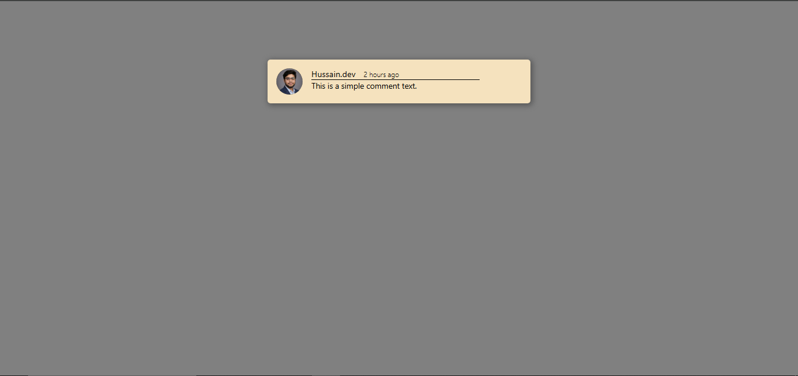
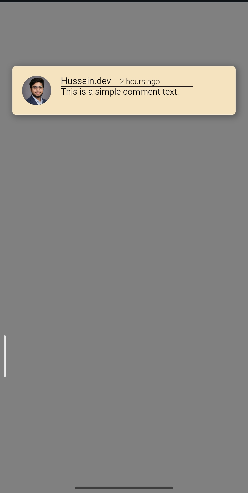

# Minimalist Responsive Comment UI 💬

A sleek and modern comment component built to demonstrate mastery over small-scale UI elements, shadow depth, and consistent personal branding.

## ✨ Key Features
- **Personal Branding:** Integrated `Hussain.dev` identity and profile avatar for a realistic social media feel.
- **Visual Depth:** Utilized professional `box-shadow` properties to create a floating "elevated" effect against the background.
- **Clean Typography:** Implementation of Sans-Serif fonts with clear hierarchy between the username, timestamp, and message body.
- **Fully Responsive:** The component maintains its structure and internal padding perfectly on mobile devices.

## 📸 Project Preview

### Desktop View

### Mobile View

  

## 🛠️ Technical Details
- **Alignment:** Flexbox used for avatar and text positioning.
- **UI Design:** Minimalist color palette with a focus on readability.
- **Responsiveness:** Media queries ensure the box doesn't overflow on small screens.
