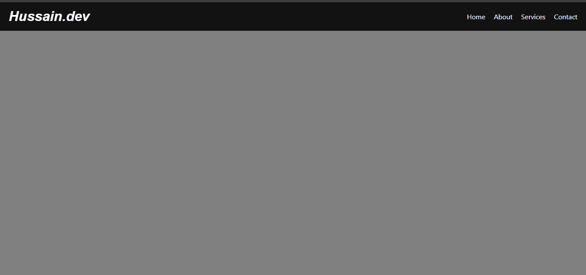

# Responsive Navigation Bar 📱💻

A modern, mobile-first navigation bar built with semantic HTML and CSS Flexbox. This component is part of my specialized study into responsive web design and professional branding.

## ✨ Key Features
- **Hussain.dev Branding:** Implemented a clean, text-based professional identity.
- **Mobile-First Approach:** Optimized for all screen sizes using CSS Media Queries.
- **Interactive Toggle:** Includes a fully functional hamburger menu for mobile users.
- **Flexbox Architecture:** Leverages Flexbox for precise alignment and spacing across devices.

## 📸 Screenshots

### Desktop View
 

### Mobile View (Menu Toggled)

## 🛠️ Technical Details
- **Logic:** Mobile-first responsive design.
- **Styling:** Custom Sans-Serif typography for a high-end tech aesthetic.
- **Components:** CSS Flexbox-ready structure for future scalability.
