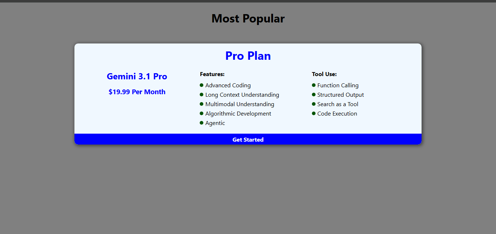
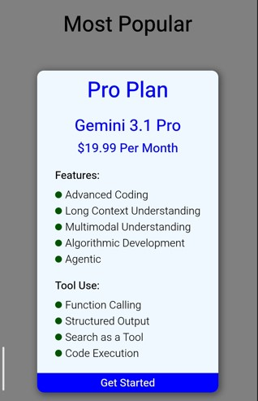

# Responsive Pricing Card 💎

A high-conversion pricing component designed with a clean, professional aesthetic. This card showcases complex feature lists and service tiers while maintaining a perfect layout across all screen sizes.

## ✨ Key Features
- **Visual Hierarchy:** Clear focus on the "Pro Plan" with a bold "Get Started" call-to-action.
- **Feature Highlighting:** Organized list of advanced technical capabilities including Advanced Coding and Agentic development.
- **Toolbox Display:** Dedicated section for specific tool uses like Function Calling and Structured Output.
- **Adaptive Layout:** Seamlessly transitions from a wide horizontal layout on desktop to a stacked vertical layout on mobile.

## 📸 Project Preview

### Desktop View

### Mobile View

  

## 🛠️ Technical Details
- **Architecture:** Flexbox for precise alignment of feature columns.
- **Styling:** Custom blue-accented theme for a modern tech-focused look.
- **Responsive Logic:** Mobile-first approach using CSS Media Queries.
